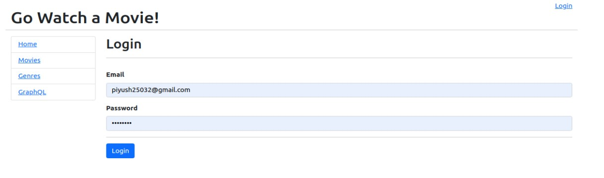

# Go Watch a Movie!
This my first React as frontend and Go as backend mini application. This application basically to handle movies along with genre.

# Requirement
1. React
2. Golang
3. Postgres

# Features
1. Add movies and genre.
2. Manage movies and genre.
3. Search movies using graphql.
4. Movie Poster added from themoviedb.com by api call.

# Start Application

1. starting frontend
```bash 
    $ cd movies-app-frontend && npm start
```
>Note:- username:-  <b>piyush25032@gmail.com <b>  password:- <b>password<b>
2. starting backend
```bash 
    $ cd movies-app-backend && go run cmd/api/*.go
```

# Screens
1. Home Screen

   <hr />
2. Login Screen

   <hr />
3. Movies Screen
   
   <hr />
4. One Movie Screen
     
   <hr />
5. Genres Screen
   
6. One Genre Screen
       
7. Add movie Screen
         
8. Manage Catalogue Screen
     
9. Edit Movie Screen
   
10. GraphQL Movies Screen
       
11. GraphQL One Movie Screen
          